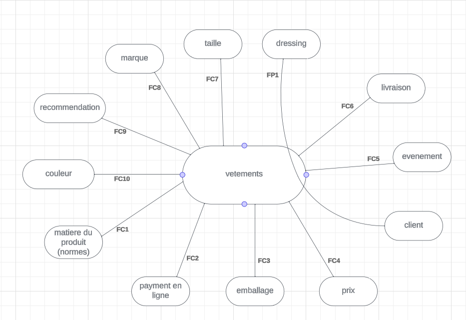

# Cahier des charges SHOPINAKA

## Sommaire

 1 presentation de la startup
 2 diagrammes
 3 Section Dressing (problematique)
 4 Chatbot

## Presentation de la startup

**SHOPINAKA** est un E-commerce basée sur l'intelligence artificielle.
Cette plateforme propose 2 sections principales : Vêtements et Dressing.

Une interface vetements, accessible a tous les visiteurs du site, où on peut consulter liberement les vetements et meme déposer des articles dans un panier, 

Une interface dressing, qui par contre necessite un compte client, où l'utilisateur importe des images de ses vétements, et SHOPINAKA génere des exemple d'outfits avec l'intelligence artificielle

Dès la page d'accueil, on invites donc l'utilisateur à se connecter ou à créer un
compte et à le renseigner du mieux possible.

## Diagrammes

#### Diagramme bete a corne

#### Diagramme de pieuvre

## Section Dressing

#### Importation d'Images

Les utilisateurs peuvent importer des images de leurs vêtements directement sur la plateforme. Ces images peuvent inclure des photos de pantalons, de chemises, de chaussures, et d'autres articles vestimentaires.

#### Analyse Visuelle

Le système effectue une analyse visuelle des images importées afin de reconnaître les différents éléments vestimentaires présents. Cette analyse repose sur l'IA pour identifier les types de vêtements, les couleurs, les motifs, et d'autres caractéristiques pertinentes.

#### Adaptabilité aux Préférences Utilisateurs

La fonction de recommandation prend également en compte les préférences individuelles des utilisateurs, telles que leurs styles préférés, leurs couleurs prédominantes, et leurs préférences saisonnières. Cela garantit que les ensembles recommandés sont en harmonie avec le goût personnel de chaque utilisateur.

## User stories

En tant que **visiteur** je souhaite **consulter les vétements** afin de **de les ajouter a un panier**.

En tant que **visiteur** je souhaite **consulter les détails des vétements** afin de **bien choisir mon article**.

En tant que **client** je souhaite **importer des images de mes vétements** afin de **d'avoir des recommendations de tenues**.

En tant que **client** je souhaite **consulet mon panier** afin d'**acheter les articles sélectionnés**.

## chatbot

#### Assistance en Temps Réel :
Le chatbot est disponible en permanence pour fournir une assistance instantanée aux utilisateurs. Il répond rapidement aux questions, offre des conseils sur les produits, et guide les utilisateurs tout au long de leur expérience sur la plateforme.

#### Conseils de style personnalisés :
Le chatbot est équipé de capacités d'analyse basées sur l'intelligence artificielle, lui permettant de comprendre les préférences de style individuelles des utilisateurs. En posant des questions ciblées et en analysant les interactions passées, le chatbot peut recommander des produits en accord avec le goût de chaque utilisateur.

#### Reclamation gestion des commandes :
Les utilisateurs peuvent utiliser le chatbot pour suivre leurs commandes, obtenir des mises à jour sur l'état de livraison, et résoudre rapidement tout problème lié à leurs achats. Le chatbot simplifie le processus de suivi des commandes et améliore l'expérience utilisateur.
